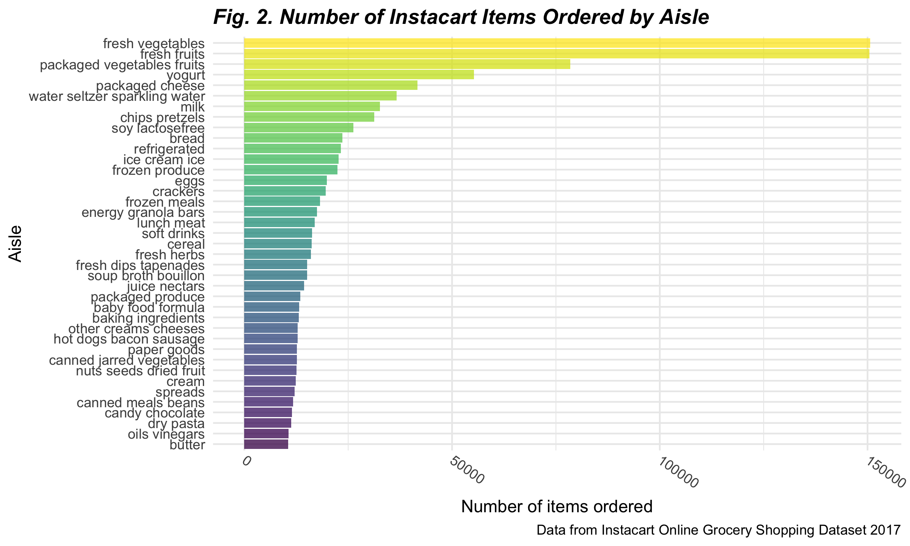
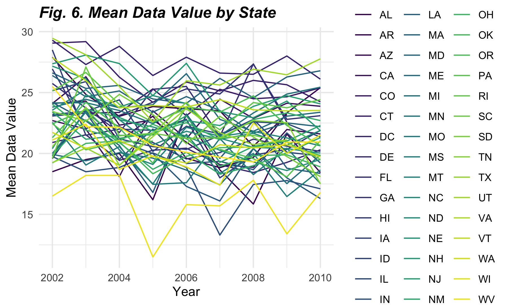
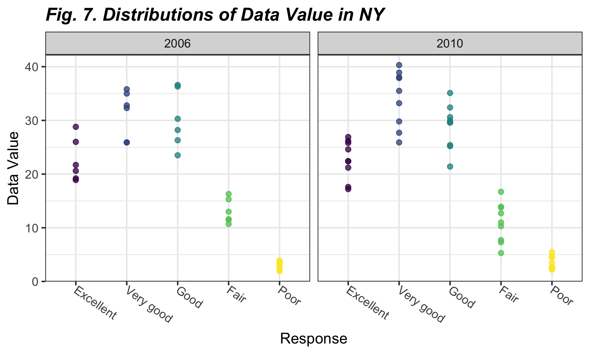

Homework 3
================
jys2137
10/14/2021

The purpose of this file is to present the answers to Homework 3, an
assignment reinforcing ideas in the **Visualization & EDA** topic for
P8105.

## Problem 1

This problem uses **“The Instacart Online Grocery Shopping Dataset
2017”**, an anonymized dataset with over 3 million online grocery orders
from more than 200,000 Instacart (online grocery service) users.

### 1.1. Loading in `instacart` dataset

First, we read in the `instacart` dataset through the code chunk below.

``` r
data("instacart")

instacart_df = 
  instacart %>% 
  as_tibble(instacart)
```

### 1.2. Description of the `instacart` dataset

The ‘Instacart’ dataset includes **1384617 rows** and **15 variables**,
where each row in the dataset is a product from an instacart order. It
consists of **131209 orders** from **131209 unique users**, including a
total of **39123 products**.

Key variables include identifiers for **order** (`order_id`),
**product** (`product_id`), and **customer** (`user_id`). Other
variables provide information on the order such as the order in which
each product was added to cart (`add_to_cart_order`), if the product has
been reordered in the past (`reordered`), and the day and time on which
the order was placed (`order_dow`and `order_hour_of_day`).

In addition, variables containing the specifics of each product were
included such as the name (e.g., “Bulgarian Yogurt”, “Mild Diced Green
Chiles”, “Organic Raspberries”), aisle (e.g. “yogurt”, “canned jarred
vegetables”, packaged vegetables fruits“), and department of the product
(e.g.,”dairy eggs“,”canned goods“,”produce").

### 1.3. Exploration of *aisles* in the `instacart` dataset

The next few steps allow for further exploration of the `instacart`
dataset as we look into:

1.  Number of aisles and aisles most ordered from
2.  Number of items from each aisle
3.  Most popular items in each of the aisles `baking ingredients`,
    `dog food care`, and `packaged vegetables fruits`

#### 1.3.1. Number of *aisles* and those most ordered from

There are **134 aisles** in total. The aisles most ordered from are
`fresh vegetables` and `fresh fruits` as seen in the table produced
below, which shows the top 10 aisles that most items are ordered from.

``` r
instacart_df %>% 
  count(aisle) %>% 
  arrange(desc(n)) %>% 
  head(n = 10) %>% 
  mutate(row_number = 1:n()) %>% 
  select(row_number, aisle, n) %>% 
  knitr::kable(
             caption = "_**Fig. 1. Top 10 Aisles Most Ordered From**_",
             col.names = c('Rank', 'Aisle', 'N'),
             align = "clc")
```

| Rank | Aisle                         |   N    |
|:----:|:------------------------------|:------:|
|  1   | fresh vegetables              | 150609 |
|  2   | fresh fruits                  | 150473 |
|  3   | packaged vegetables fruits    | 78493  |
|  4   | yogurt                        | 55240  |
|  5   | packaged cheese               | 41699  |
|  6   | water seltzer sparkling water | 36617  |
|  7   | milk                          | 32644  |
|  8   | chips pretzels                | 31269  |
|  9   | soy lactosefree               | 26240  |
|  10  | bread                         | 23635  |

***Fig. 1. Top 10 Aisles Most Ordered From***

#### 1.3.2. Number of items from each aisle

Next, we produce a plot that shows the number of items ordered in each
aisle. Only aisles with more than 10000 items ordered are included.

``` r
instacart_df %>% 
  count(aisle) %>% 
  filter(n > 10000) %>% 
  mutate(aisle = fct_reorder(aisle, n)) %>% 
  ggplot(aes(x = aisle, y = n, fill = aisle)) + 
  geom_bar(stat = "identity", alpha = .75) +
  coord_flip() +
  theme(
    axis.text.x = element_text(angle = -35, hjust = 0, vjust = .5),
    plot.title = element_text(face = "bold.italic" ),
    legend.position = "none") +
  labs(
    title = "Fig. 2. Number of Instacart Items Ordered by Aisle", 
    x = "Aisle",
    y = "Number of items ordered",
    caption = "Data from Instacart Online Grocery Shopping Dataset 2017") 
```



#### 1.3.3. Most popular items

Now, we use a table showing the **three most popular items** in each of
the aisles `baking ingredients`, `dog food care`, and
`packaged vegetables fruits`, including the number of times each item
was ordered.

``` r
pop_item =
  instacart_df %>% 
  filter(aisle == c("baking ingredients", "dog food care", "packaged vegetables fruits")) %>%
  group_by(aisle) %>% 
  count(product_name) %>%
  mutate(rank = rank(desc(n))) %>% 
  filter(rank < 4) %>% 
  mutate(product_name_count = paste(product_name, "-", "ordered", n, "times")) %>%
  select(-n, -product_name) %>% 
  arrange(rank) %>% 
  pivot_wider(
    names_from = aisle, 
    values_from = product_name_count)

knitr::kable(pop_item,
             caption = "_**Fig. 3. Top 3 Items Ordered by Aisle**_", 
             format = "simple", 
             col.names = str_to_title(names(pop_item)),
             align = "clll")
```

| Rank | Baking Ingredients                          | Dog Food Care                                                      | Packaged Vegetables Fruits                |
|:----:|:--------------------------------------------|:-------------------------------------------------------------------|:------------------------------------------|
|  1   | Light Brown Sugar - ordered 157 times       | Organix Grain Free Chicken & Vegetable Dog Food - ordered 14 times | Organic Baby Spinach - ordered 3324 times |
|  2   | Pure Baking Soda - ordered 140 times        | Organix Chicken & Brown Rice Recipe - ordered 13 times             | Organic Raspberries - ordered 1920 times  |
|  3   | Organic Vanilla Extract - ordered 122 times | Original Dry Dog - ordered 9 times                                 | Organic Blueberries - ordered 1692 times  |

***Fig. 3. Top 3 Items Ordered by Aisle***

### 1.4. `Pink Lady Apples` and `Coffee Ice Cream`

Here, a table is used to show the **mean hour** of the day at which
`Pink Lady Apples` and `Coffee Ice Cream` are ordered on **each day** of
the week. This table has been formatted for human readers (2 x 7 table).

``` r
instacart_df %>%
  group_by(product_name, order_dow) %>%
  filter(product_name %in% c("Pink Lady Apples", "Coffee Ice Cream")) %>%
  summarize(mean_hour = mean(order_hour_of_day)) %>% 
  mutate(order_dow = recode(order_dow, 
                            `0` = "Sun", `1` = "Mon", `2` = "Tues", 
                            `3` = "Wed", `4` = "Thurs", `5` = "Fri", 
                            `6` = "Sat")) %>% 
  pivot_wider(
    names_from = "order_dow", 
    values_from = "mean_hour") %>%
  arrange(desc(product_name)) %>% 
  rename(Product = product_name) %>% 
  knitr::kable(
             digits = 2,
             caption = "_**Fig. 4. Mean Hour of Day for Pink Lady Appples and Coffee Ice Cream**_")
```

| Product          |   Sun |   Mon |  Tues |   Wed | Thurs |   Fri |   Sat |
|:-----------------|------:|------:|------:|------:|------:|------:|------:|
| Pink Lady Apples | 13.44 | 11.36 | 11.70 | 14.25 | 11.55 | 12.78 | 11.94 |
| Coffee Ice Cream | 13.77 | 14.32 | 15.38 | 15.32 | 15.22 | 12.26 | 13.83 |

***Fig. 4. Mean Hour of Day for Pink Lady Appples and Coffee Ice
Cream***

From this table, it can be seen that for most days, **pink lady apples**
are ordered *earlier in the day* compared to **coffee ice cream**
purchases. However, Friday seems to be the exception when coffee ice
cream was ordered slightly earlier than pink lady apples.

## Problem 2

This problem uses data accessed from data.gov from the **Behavioral Risk
Factors Surveillance System for Selected Metropolitan Area Risk Trends
(SMART) for 2002-2010**, or `BRFSS` for short, which consists of
information about modifiable risk factors for chronic diseases and other
leading causes of death.

### 2.1. Loading in the `BRFSS` dataset

First, we read in the `BRFSS` dataset and conduct some data cleaning by:

-   formatting the data to use appropriate variable names;
-   focusing on the “Overall Health” topic
-   including only responses from “Excellent” to “Poor”
-   organizing responses as a factor taking levels ordered from “Poor”
    to “Excellent”

``` r
data("brfss_smart2010")

brfss_df =
  brfss_smart2010 %>% 
  janitor::clean_names() %>% 
  filter(topic == "Overall Health") %>% 
  mutate(response = as_factor(response)) %>% 
  arrange(desc(response)) %>% 
  rename(state = locationabbr, location = locationdesc, resp_id = respid)
```

### 2.2. Exploration of the `BRFSS` dataset

Using the `BRFSS` dataset, we will create:

1.  A table of states observed at 7 or more locations in 2002 and 2010
2.  A spaghetti plot of the average data value over time by state
3.  A two-panel plot showing the distribution of data value in NY for
    2006 and 2010

#### 2.2.1. States observed at 7 or more locations in 2002 and 2010

``` r
brfss_states =
  brfss_df %>% 
  group_by(year, state) %>% 
  summarize(state_count = n()) %>% 
  filter(year == 2002 | year == 2010, state_count >= 7) %>% 
  pivot_wider(names_from = year, values_from = state_count) %>% 
  arrange(state)

knitr::kable(brfss_states,
             format = "simple",
             col.names = c("State", "2002", "2010"),
             caption = "_**Fig. 5. States observed at 7 or more locations in 2002 and 2010**_")
```

| State | 2002 | 2010 |
|:------|-----:|-----:|
| AL    |   NA |   15 |
| AR    |   NA |   15 |
| AZ    |   10 |   15 |
| CA    |   NA |   60 |
| CO    |   20 |   35 |
| CT    |   35 |   25 |
| DE    |   15 |   15 |
| FL    |   35 |  205 |
| GA    |   15 |   20 |
| HI    |   20 |   20 |
| IA    |   NA |   10 |
| ID    |   10 |   30 |
| IL    |   15 |   10 |
| IN    |   10 |   15 |
| KS    |   15 |   20 |
| LA    |   15 |   25 |
| MA    |   40 |   45 |
| MD    |   30 |   60 |
| ME    |   10 |   30 |
| MI    |   20 |   20 |
| MN    |   20 |   25 |
| MO    |   10 |   15 |
| MS    |   NA |   10 |
| MT    |   NA |   15 |
| NC    |   35 |   60 |
| ND    |   NA |   15 |
| NE    |   15 |   50 |
| NH    |   25 |   25 |
| NJ    |   40 |   95 |
| NM    |   NA |   30 |
| NV    |   10 |   10 |
| NY    |   25 |   45 |
| OH    |   20 |   40 |
| OK    |   15 |   15 |
| OR    |   15 |   20 |
| PA    |   50 |   35 |
| RI    |   20 |   25 |
| SC    |   15 |   35 |
| SD    |   10 |   10 |
| TN    |   10 |   25 |
| TX    |   10 |   80 |
| UT    |   25 |   30 |
| VT    |   15 |   30 |
| WA    |   20 |   50 |
| WY    |   NA |   10 |

***Fig. 5. States observed at 7 or more locations in 2002 and 2010***

In *2002*, there were **36 states** that were observed at 7 or more
locations while in *2010*, there were **45 states** with 7 or more
observation locations.

#### 2.2.2. Spaghetti plot

The following code chunk establishes a dataset that is:

-   limited to Excellent responses; and
-   contains `year`, `state`, and `mean_data_value` (a variable that
    averages the `data_value` across locations within a state)

This also creates a “spaghetti” plot of this average value over time
within a state (showing a line for each state across years).

``` r
brfss_df %>% 
  filter(response == "Excellent") %>% 
  group_by(state, year) %>% 
  summarize(mean_data_value = mean(data_value)) %>% 
  ggplot(aes(x = year, y = mean_data_value, group = state, color = state)) +
  geom_line() +
  scale_color_viridis_d() +
  labs(x = "Year", y = "Mean Data Value", title = "Fig. 6. Mean Data Value by State") +
  theme(
    plot.title = element_text(face = "bold"),
    legend.position = "right")
```

    ## `summarise()` has grouped output by 'state'. You can override using the `.groups` argument.



#### 2.2.3. Distribution of `data_value` in NY

Next, we develop a two-panel plot showing, for the years 2006 and 2010,
distribution of `data_value` for responses (“Poor” to “Excellent”) among
locations in NY State.

``` r
brfss_df %>% 
  filter(year == "2006" | year == "2010", state == "NY") %>% 
  ggplot(aes(x = response, y = data_value, color = year)) +
  geom_point() +
  facet_grid(~year) +
  labs(
    x = "Response", 
    y = "Data Value", 
    title = "Fig. 7. Distributions of Data Value in NY") +
  theme_bw() +
  theme(
    legend.position = "none",
    axis.text.x = element_text(angle = -35, hjust = 0, vjust = .5),
    plot.title = element_text(face = "bold.italic"))
```


