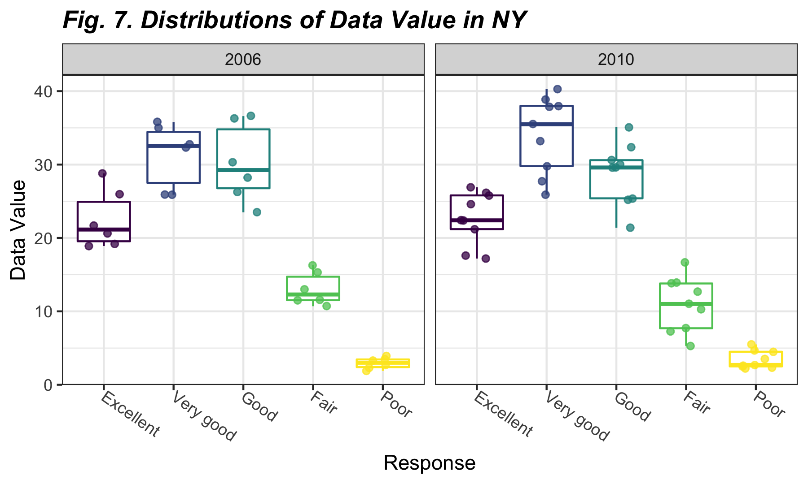
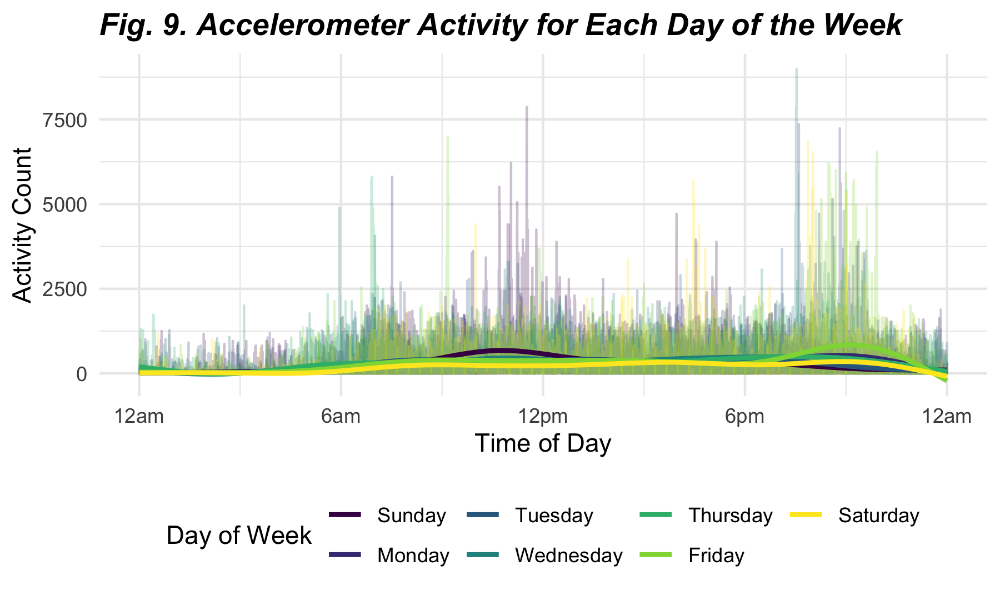
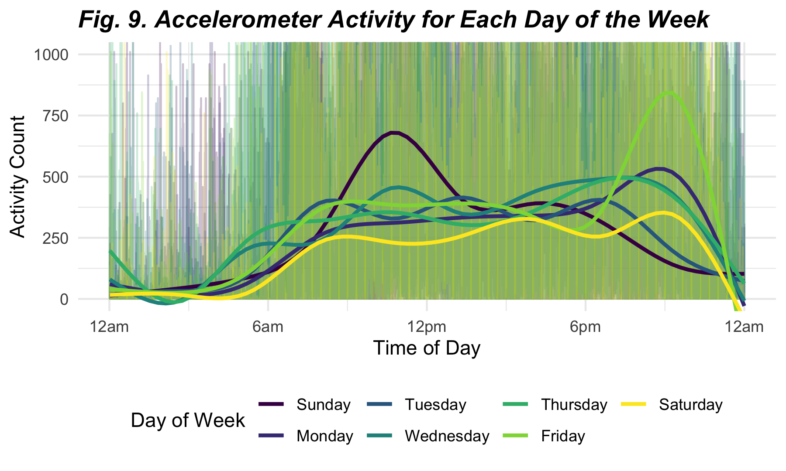

Homework 3
================
jys2137
10/14/2021

The purpose of this file is to present the answers to Homework 3, an
assignment reinforcing ideas in the **Visualization & EDA** topic for
P8105.

## Problem 1

This problem uses **“The Instacart Online Grocery Shopping Dataset
2017”**, an anonymized dataset with over 3 million online grocery orders
from more than 200,000 Instacart (online grocery service) users.

### 1.1. Loading in `instacart` dataset

First, we read in the `instacart` dataset through the code chunk below.

``` r
data("instacart")

instacart_df = 
  instacart %>% 
  as_tibble(instacart)

instacart_df
```

    ## # A tibble: 1,384,617 × 15
    ##    order_id product_id add_to_cart_order reordered user_id eval_set order_number
    ##       <int>      <int>             <int>     <int>   <int> <chr>           <int>
    ##  1        1      49302                 1         1  112108 train               4
    ##  2        1      11109                 2         1  112108 train               4
    ##  3        1      10246                 3         0  112108 train               4
    ##  4        1      49683                 4         0  112108 train               4
    ##  5        1      43633                 5         1  112108 train               4
    ##  6        1      13176                 6         0  112108 train               4
    ##  7        1      47209                 7         0  112108 train               4
    ##  8        1      22035                 8         1  112108 train               4
    ##  9       36      39612                 1         0   79431 train              23
    ## 10       36      19660                 2         1   79431 train              23
    ## # … with 1,384,607 more rows, and 8 more variables: order_dow <int>,
    ## #   order_hour_of_day <int>, days_since_prior_order <int>, product_name <chr>,
    ## #   aisle_id <int>, department_id <int>, aisle <chr>, department <chr>

### 1.2. Description of the `instacart` dataset

The ‘Instacart’ dataset includes **1384617 rows** and **15 variables**,
where each row in the dataset is a product from an instacart order. It
consists of **131209 orders** from **131209 unique users**, including a
total of **39123 products**.

Key variables include identifiers for **order** (`order_id`),
**product** (`product_id`), and **customer** (`user_id`). Other
variables provide information on the order such as the order in which
each product was added to cart (`add_to_cart_order`), if the product has
been reordered in the past (`reordered`), and the day and time on which
the order was placed (`order_dow`and `order_hour_of_day`).

In addition, variables containing the specifics of each product were
included such as the name (e.g., “Bulgarian Yogurt”, “Mild Diced Green
Chiles”, “Organic Raspberries”), aisle (e.g. “yogurt”, “canned jarred
vegetables”, packaged vegetables fruits“), and department of the product
(e.g.,”dairy eggs“,”canned goods“,”produce").

### 1.3. Exploration of *aisles* in the `instacart` dataset

The next few steps allow for further exploration of the `instacart`
dataset as we look into:

1.  Number of aisles and aisles most ordered from
2.  Number of items from each aisle
3.  Most popular items in each of the aisles `baking ingredients`,
    `dog food care`, and `packaged vegetables fruits`

#### 1.3.1. Number of *aisles* and those most ordered from

There are **134 aisles** in total. The aisles most ordered from are
`fresh vegetables` and `fresh fruits` as seen in the table produced
below, which shows the top 10 aisles that most items are ordered from.

``` r
instacart_df %>% 
  count(aisle) %>% 
  arrange(desc(n)) %>% 
  head(n = 10) %>% 
  mutate(row_number = 1:n()) %>% 
  select(row_number, aisle, n) %>% 
  knitr::kable(
             caption = "_**Fig. 1. Top 10 Aisles Most Ordered From**_",
             col.names = c('Rank', 'Aisle', 'N'),
             align = "clc")
```

| Rank | Aisle                         |   N    |
|:----:|:------------------------------|:------:|
|  1   | fresh vegetables              | 150609 |
|  2   | fresh fruits                  | 150473 |
|  3   | packaged vegetables fruits    | 78493  |
|  4   | yogurt                        | 55240  |
|  5   | packaged cheese               | 41699  |
|  6   | water seltzer sparkling water | 36617  |
|  7   | milk                          | 32644  |
|  8   | chips pretzels                | 31269  |
|  9   | soy lactosefree               | 26240  |
|  10  | bread                         | 23635  |

***Fig. 1. Top 10 Aisles Most Ordered From***

#### 1.3.2. Number of *items* from each aisle

Next, we produce a plot that shows the number of items ordered in each
aisle. Only aisles with more than 10000 items ordered are included.

``` r
instacart_df %>% 
  count(aisle) %>% 
  filter(n > 10000) %>% 
  mutate(aisle = fct_reorder(aisle, n)) %>% 
  ggplot(aes(x = aisle, y = n, fill = aisle)) + 
  geom_bar(stat = "identity", alpha = .75) +
  coord_flip() +
  theme(
    axis.text.x = element_text(angle = -35, hjust = 0, vjust = .5),
    plot.title = element_text(face = "bold.italic" ),
    legend.position = "none") +
  labs(
    title = "Fig. 2. Number of Instacart Items Ordered by Aisle", 
    x = "Aisle",
    y = "Number of items ordered",
    caption = "Data from Instacart Online Grocery Shopping Dataset 2017") 
```


#### 1.3.3. Most popular items

Now, we use a table showing the **three most popular items** in each of
the aisles `baking ingredients`, `dog food care`, and
`packaged vegetables fruits`, including the number of times each item
was ordered.

``` r
pop_item =
  instacart_df %>% 
  filter(aisle %in% c("baking ingredients", "dog food care", "packaged vegetables fruits")) %>%
  group_by(aisle) %>% 
  count(product_name) %>%
  mutate(rank = rank(desc(n))) %>% 
  filter(rank < 4) %>% 
  mutate(product_name_count = paste(product_name, "-", "ordered", n, "times")) %>%
  select(-n, -product_name) %>% 
  arrange(rank) %>% 
  pivot_wider(
    names_from = aisle, 
    values_from = product_name_count)

knitr::kable(pop_item,
             format = "pipe", 
             caption = "_**Fig. 3. Top 3 Items Ordered by Aisle**_", 
             col.names = str_to_title(names(pop_item)),
             align = "clll")
```

| Rank | Baking Ingredients                    | Dog Food Care                                                    | Packaged Vegetables Fruits                |
|:----:|:--------------------------------------|:-----------------------------------------------------------------|:------------------------------------------|
|  1   | Light Brown Sugar - ordered 499 times | Snack Sticks Chicken & Rice Recipe Dog Treats - ordered 30 times | Organic Baby Spinach - ordered 9784 times |
|  2   | Pure Baking Soda - ordered 387 times  | Organix Chicken & Brown Rice Recipe - ordered 28 times           | Organic Raspberries - ordered 5546 times  |
|  3   | Cane Sugar - ordered 336 times        | Small Dog Biscuits - ordered 26 times                            | Organic Blueberries - ordered 4966 times  |

***Fig. 3. Top 3 Items Ordered by Aisle***

### 1.4. `Pink Lady Apples` and `Coffee Ice Cream`

Here, a table is used to show the **mean hour** of the day at which
`Pink Lady Apples` and `Coffee Ice Cream` are ordered on **each day** of
the week. This table has been formatted for human readers (2 x 7 table).

``` r
pink_coff_table = 
  instacart_df %>%
  group_by(product_name, order_dow) %>%
  filter(product_name %in% c("Pink Lady Apples", "Coffee Ice Cream")) %>%
  summarize(mean_hour = mean(order_hour_of_day)) %>% 
  mutate(order_dow = recode(order_dow, 
                            `0` = "Sun", `1` = "Mon", `2` = "Tues", 
                            `3` = "Wed", `4` = "Thurs", `5` = "Fri", 
                            `6` = "Sat")) %>% 
  pivot_wider(
    names_from = "order_dow", 
    values_from = "mean_hour") %>%
  arrange(desc(product_name)) %>% 
  rename(Product = product_name) 

  knitr::kable(pink_coff_table,
             digits = 2,
             caption = "_**Fig. 4. Mean Hour of Day for Pink Lady Appples and Coffee Ice Cream**_")
```

| Product          |   Sun |   Mon |  Tues |   Wed | Thurs |   Fri |   Sat |
|:-----------------|------:|------:|------:|------:|------:|------:|------:|
| Pink Lady Apples | 13.44 | 11.36 | 11.70 | 14.25 | 11.55 | 12.78 | 11.94 |
| Coffee Ice Cream | 13.77 | 14.32 | 15.38 | 15.32 | 15.22 | 12.26 | 13.83 |

***Fig. 4. Mean Hour of Day for Pink Lady Appples and Coffee Ice
Cream***

From this table, it can be seen that for most days, **pink lady apples**
are ordered *earlier in the day* compared to **coffee ice cream**
purchases. However, Friday seems to be the exception when coffee ice
cream was ordered slightly earlier than pink lady apples.

## Problem 2

This problem uses data accessed from data.gov from the **Behavioral Risk
Factors Surveillance System for Selected Metropolitan Area Risk Trends
(SMART) for 2002-2010**, or `BRFSS` for short, which consists of
information about modifiable risk factors for chronic diseases and other
leading causes of death.

### 2.1. Loading in the `BRFSS` dataset

First, we read in the `BRFSS` dataset and conduct some data cleaning by:

-   formatting the data to use appropriate variable names;
-   focusing on the “Overall Health” topic
-   including only responses from “Excellent” to “Poor”
-   organizing responses as a factor taking levels ordered from “Poor”
    to “Excellent”

``` r
data("brfss_smart2010")

brfss_df =
  brfss_smart2010 %>% 
  janitor::clean_names() %>% 
  filter(topic == "Overall Health") %>% 
  mutate(response = as_factor(response)) %>% 
  arrange(desc(response)) %>% 
  rename(state = locationabbr, county = locationdesc)

head(brfss_df)
```

    ## # A tibble: 6 × 23
    ##    year state county    class  topic  question   response sample_size data_value
    ##   <int> <chr> <chr>     <chr>  <chr>  <chr>      <fct>          <int>      <dbl>
    ## 1  2010 AL    AL - Jef… Healt… Overa… How is yo… Poor              45        5.5
    ## 2  2010 AL    AL - Mob… Healt… Overa… How is yo… Poor              66        6.4
    ## 3  2010 AL    AL - Tus… Healt… Overa… How is yo… Poor              35        4.2
    ## 4  2010 AZ    AZ - Mar… Healt… Overa… How is yo… Poor              62        3.5
    ## 5  2010 AZ    AZ - Pim… Healt… Overa… How is yo… Poor              49        5.7
    ## 6  2010 AZ    AZ - Pin… Healt… Overa… How is yo… Poor              30        4  
    ## # … with 14 more variables: confidence_limit_low <dbl>,
    ## #   confidence_limit_high <dbl>, display_order <int>, data_value_unit <chr>,
    ## #   data_value_type <chr>, data_value_footnote_symbol <chr>,
    ## #   data_value_footnote <chr>, data_source <chr>, class_id <chr>,
    ## #   topic_id <chr>, location_id <chr>, question_id <chr>, respid <chr>,
    ## #   geo_location <chr>

### 2.2. States observed at 7 or more locations in 2002 and 2010

Using the `BRFSS` dataset, we will create a table of states observed at
7 or more locations in 2002 and 2010.

``` r
brfss_states =
  brfss_df %>% 
  group_by(year, state) %>% 
  summarize(num_locations = n()) %>% 
  filter(year %in% c(2002, 2010), 
         num_locations >= 7) %>% 
  pivot_wider(names_from = year, values_from = num_locations) %>% 
  arrange(state)

knitr::kable(brfss_states,
             col.names = c("State", "2002", "2010"),
             caption = "_**Fig. 5. States observed at 7 or more locations in 2002 and 2010**_")
```

| State | 2002 | 2010 |
|:------|-----:|-----:|
| AL    |   NA |   15 |
| AR    |   NA |   15 |
| AZ    |   10 |   15 |
| CA    |   NA |   60 |
| CO    |   20 |   35 |
| CT    |   35 |   25 |
| DE    |   15 |   15 |
| FL    |   35 |  205 |
| GA    |   15 |   20 |
| HI    |   20 |   20 |
| IA    |   NA |   10 |
| ID    |   10 |   30 |
| IL    |   15 |   10 |
| IN    |   10 |   15 |
| KS    |   15 |   20 |
| LA    |   15 |   25 |
| MA    |   40 |   45 |
| MD    |   30 |   60 |
| ME    |   10 |   30 |
| MI    |   20 |   20 |
| MN    |   20 |   25 |
| MO    |   10 |   15 |
| MS    |   NA |   10 |
| MT    |   NA |   15 |
| NC    |   35 |   60 |
| ND    |   NA |   15 |
| NE    |   15 |   50 |
| NH    |   25 |   25 |
| NJ    |   40 |   95 |
| NM    |   NA |   30 |
| NV    |   10 |   10 |
| NY    |   25 |   45 |
| OH    |   20 |   40 |
| OK    |   15 |   15 |
| OR    |   15 |   20 |
| PA    |   50 |   35 |
| RI    |   20 |   25 |
| SC    |   15 |   35 |
| SD    |   10 |   10 |
| TN    |   10 |   25 |
| TX    |   10 |   80 |
| UT    |   25 |   30 |
| VT    |   15 |   30 |
| WA    |   20 |   50 |
| WY    |   NA |   10 |

***Fig. 5. States observed at 7 or more locations in 2002 and 2010***

In *2002*, there were **36 states** that were observed at 7 or more
locations while in *2010*, there were **45 states** with 7 or more
observation locations.

### 2.3. Spaghetti plot

The following code chunk establishes a dataset that is:

-   limited to Excellent responses; and
-   contains `year`, `state`, and `mean_data_value` (a variable that
    averages the `data_value` across locations within a state)

This also creates a “spaghetti” plot of this average value over time
within a state (showing a line for each state across years).

``` r
brfss_df %>% 
  filter(response == "Excellent") %>% 
  group_by(year, state) %>% 
  summarize(mean_data_value = mean(data_value)) %>% 
  ggplot(aes(x = year, y = mean_data_value, group = state, color = state)) +
  geom_line() +
  scale_color_viridis_d() +
  labs(x = "Year", y = "Mean Data Value", title = "Fig. 6. Mean Data Value by State") +
  theme(
    plot.title = element_text(face = "bold.italic"),
    legend.position = "right")
```

    ## `summarise()` has grouped output by 'year'. You can override using the `.groups` argument.


### 2.4. Distribution of `data_value` in NY

Next, we develop a two-panel plot showing, for the years 2006 and 2010,
distribution of `data_value` for responses (“Poor” to “Excellent”) among
locations in NY State.

``` r
brfss_df %>% 
  filter(
    year %in% c(2006, 2010), 
    state %in% c("NY")) %>% 
  ggplot(aes(x = response, y = data_value, color = year)) +
  geom_point(alpha = .75) +
  facet_grid(~year) +
  theme_bw() +
  theme(
    legend.position = "none",
    axis.text.x = element_text(angle = -35, hjust = 0, vjust = .5),
    plot.title = element_text(face = "bold.italic")) +
  labs(
    x = "Response", 
    y = "Data Value", 
    title = "Fig. 7. Distributions of Data Value in NY")
```



## Problem 3

This problem uses five weeks of accelerometer data collected on a 63
year-old male with BMI 25, who was admitted to the Advanced Cardiac Care
Center of Columbia University Medical Center and diagnosed with
congestive heart failure (CHF).

### 3.1. Loading in the `accel` dataset

Here, we load, tidy, and wrangle the `accel` data. This final dataset:

-   includes all originally observed variables and values
-   has useful variable names
-   includes a `weekday` vs `weekend` variable
-   encodes data with reasonable variable classes

``` r
accel_df = 
  read_csv("./data/accel_data.csv") %>% 
  janitor::clean_names() %>% 
  pivot_longer(
    activity_1:activity_1440,
    names_to = "minute",
    names_prefix = "activity_", 
    values_to = "activity_count") %>% 
  mutate(
    minute = as.numeric(minute),
    day = factor(day, levels = c("Sunday", "Monday", "Tuesday", "Wednesday","Thursday", "Friday", "Saturday")),
    weekday_weekend = as.numeric(day %in% c("Saturday", "Sunday")),
    weekday_weekend = recode(weekday_weekend, 
                             `0` = "weekday", `1` = "weekend"))

head(accel_df)
```

    ## # A tibble: 6 × 6
    ##    week day_id day    minute activity_count weekday_weekend
    ##   <dbl>  <dbl> <fct>   <dbl>          <dbl> <chr>          
    ## 1     1      1 Friday      1           88.4 weekday        
    ## 2     1      1 Friday      2           82.2 weekday        
    ## 3     1      1 Friday      3           64.4 weekday        
    ## 4     1      1 Friday      4           70.0 weekday        
    ## 5     1      1 Friday      5           75.0 weekday        
    ## 6     1      1 Friday      6           66.3 weekday

#### Brief description of the final `accel` dataset

The final `accel` dataset includes **50400 observations** and **6
variables**, which include `week`, `day_id`,`day`, `minute`,
`activity_count`, and `weekday_weekend` which signified if the day was a
*weekday* or *weekend.*

### 3.2. Total activity for each day

Using the accelerometer data, we create a plot of total activity for
each day. We do this by using the previously tidied dataset and
aggregating across minutes to create a total activity variable,
`activity_tot` for each day, through the code chunk below.

``` r
act_table =
  accel_df %>% 
  group_by(day, week) %>% 
  summarize(activity_tot = sum(activity_count)) %>% 
  pivot_wider(
    names_from = day, 
    values_from = activity_tot) %>%
  rename(Week = week) 
```

    ## `summarise()` has grouped output by 'day'. You can override using the `.groups` argument.

``` r
  knitr::kable(act_table,
             caption = "_**Fig. 8. Total Activity By Day**_",
             align = "cccccccc",
             digit = 0)
```

| Week | Sunday | Monday | Tuesday | Wednesday | Thursday | Friday | Saturday |
|:----:|:------:|:------:|:-------:|:---------:|:--------:|:------:|:--------:|
|  1   | 631105 | 78828  | 307094  |  340115   |  355924  | 480543 |  376254  |
|  2   | 422018 | 295431 | 423245  |  440962   |  474048  | 568839 |  607175  |
|  3   | 467052 | 685910 | 381507  |  468869   |  371230  | 467420 |  382928  |
|  4   | 260617 | 409450 | 319568  |  434460   |  340291  | 154049 |   1440   |
|  5   | 138421 | 389080 | 367824  |  445366   |  549658  | 620860 |   1440   |

***Fig. 8. Total Activity By Day***

#### Brief description of apparent trends

The table above indicates that **Saturdays** have the **least
activity**, with two Saturdays having a total activity of 1440 minutes.
However, for these it looks like there was a possible data collection
error – the value of “1” was input into the total activity variable for
each minute in those days. Thus, this might not actually have any
inherent value in relation to figuring out whether there are trends that
can be pulled out simply from this table.

In conclusion, there are no clear trends that can be garnered through
observation of this table. Instead, additional analyses must be
conducted to lend confidence into any possible trend that may exist in
average total activity each day throughout the week.

### 3.3. Activity time courses by day

Finally, we create a single-panel plot that shows the 24-hour activity
time courses for each day and uses color to indicate day of the week.

``` r
accel_act_plot = 
  accel_df %>% 
  group_by(week,day) %>% 
  ggplot(aes(x = minute, y = activity_count, group = day, color = day)) + 
  geom_line(alpha = .25) + 
  geom_smooth(se = FALSE, size = 1) +
  scale_x_continuous(breaks = c(0, 360, 720, 1080, 1440),
                     labels = c("12am", "6am", "12pm", "6pm", "12am")) +
  scale_colour_discrete(name = "Day of Week") +
  labs(x = "Time of Day", y = "Activity Count", title = "Fig. 9. Accelerometer Activity for Each Day of the Week") +
  theme(plot.title = element_text(face = "bold.italic"))

accel_act_plot
```

    ## `geom_smooth()` using method = 'gam' and formula 'y ~ s(x, bs = "cs")'



In order to better see the trend lines, below we zoom in and can take a
closer look.

    ## `geom_smooth()` using method = 'gam' and formula 'y ~ s(x, bs = "cs")'



#### Conclusions on activity time

Based on this graph, which illustrates activity throughout the each day
(colored by day of the week), we can see the following patterns:

-   Activity was ***higher** during the day*, and ***lower** at night*,
    from 12am to 6am. This makes sense, as most people are asleep at
    those hours and are moving around during the day.
-   There is a ***spike*** in activity at *noon*, mainly on *Sundays*.
    This is likely due to people going out for lunch at this time.
-   An additional ***increase*** in activity takes place on *Friday
    evenings* after 6pm. This may be due to people going out and
    socializing at that time.
