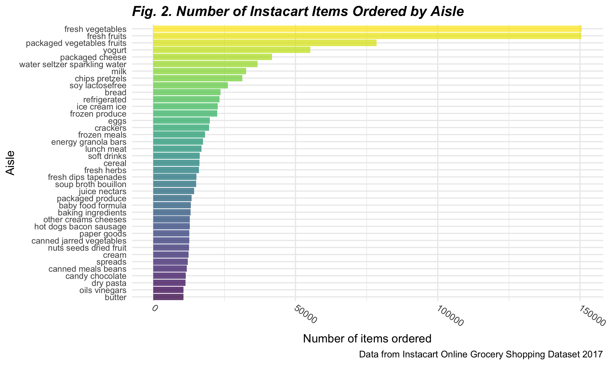

Homework 3
================
jys2137
10/14/2021

The purpose of this file is to present the answers to Homework 3, an
assignment reinforcing ideas in the **Visualization & EDA** topic for
P8105.

## Problem 1

This problem uses **“The Instacart Online Grocery Shopping Dataset
2017”**, an anonymized dataset with over 3 million online grocery orders
from more than 200,000 Instacart (online grocery service) users.

### 1. Loading in `instacart` dataset

First, we read in the `instacart` dataset through the code chunk below.

``` r
data("instacart")

instacart_df = 
  instacart %>% 
  as_tibble(instacart)
```

### 2. Description of the `instacart` dataset

The ‘Instacart’ dataset includes **1384617 rows** and **15 variables**,
where each row in the dataset is a product from an instacart order. It
consists of **131209 orders** from **131209 unique users**, including a
total of **39123 products**.

Key variables include identifiers for **order** (`order_id`),
**product** (`product_id`), and **customer** (`user_id`). Other
variables provide information on the order such as the order in which
each product was added to cart (`add_to_cart_order`), if the product has
been reordered in the past (`reordered`), and the day and time on which
the order was placed (`order_dow`and `order_hour_of_day`).

In addition, variables containing the specifics of each product were
included such as the name (e.g., “Bulgarian Yogurt”, “Mild Diced Green
Chiles”, “Organic Raspberries”), aisle (e.g. “yogurt”, “canned jarred
vegetables”, packaged vegetables fruits“), and department of the product
(e.g.,”dairy eggs“,”canned goods“,”produce").

### 3. Exploration of *aisles* in the `instacart` dataset

The next few steps allow for further exploration of the `instacart`
dataset as we look into:

1.  Number of aisles and aisles most ordered from
2.  Number of items from each aisle
3.  Most popular items in each of the aisles `baking ingredients`,
    `dog food care`, and `packaged vegetables fruits`

#### 3.1. Number of *aisles* and those most ordered from

There are **134 aisles** in total. The aisles most ordered from are
`fresh vegetables` and `fresh fruits` as seen in the table produced
below, which shows the top 10 aisles that most items are ordered from.

``` r
aisle_table =
  instacart_df %>% 
  count(aisle) %>% 
  arrange(desc(n)) %>% 
  head(n = 10) %>% 
  mutate(row_number = 1:n()) %>% 
  select(row_number, aisle, n)

knitr::kable(aisle_table,
             caption = "_**Fig. 1. Top 10 Aisles Most Ordered From**_",
             col.names = c('Rank', 'Aisle', 'N'),
             align = "clc")
```

| Rank | Aisle                         |   N    |
|:----:|:------------------------------|:------:|
|  1   | fresh vegetables              | 150609 |
|  2   | fresh fruits                  | 150473 |
|  3   | packaged vegetables fruits    | 78493  |
|  4   | yogurt                        | 55240  |
|  5   | packaged cheese               | 41699  |
|  6   | water seltzer sparkling water | 36617  |
|  7   | milk                          | 32644  |
|  8   | chips pretzels                | 31269  |
|  9   | soy lactosefree               | 26240  |
|  10  | bread                         | 23635  |

***Fig. 1. Top 10 Aisles Most Ordered From***

#### 3.2. Number of items from each aisle

Next, we produce a plot that shows the number of items ordered in each
aisle. Only aisles with more than 10000 items ordered are included.

``` r
aisle_plot =
  instacart_df %>% 
  count(aisle) %>% 
  filter(n > 10000) %>% 
  mutate(aisle = fct_reorder(aisle, desc(n))) %>% 
  ggplot(aes(x = aisle, y = n, fill = aisle)) + 
  geom_bar(stat = "identity") +
  theme(
    axis.text.x = element_text(angle = -65, hjust = 0, vjust = .5,),
    plot.title = element_text(face = "bold.italic" ),
    legend.position = "none") +
  labs(
    title = "Fig. 2. Number of Instacart Items Ordered by Aisle", 
    x = "Aisle",
    y = "Number of items ordered",
    caption = "Data from Instacart Online Grocery Shopping Dataset 2017") 

aisle_plot
```



#### 3.3. Most popular items

Now, we use a table showing the **three most popular items** in each of
the aisles `baking ingredients`, `dog food care`, and
`packaged vegetables fruits`, including the number of times each item
was ordered.

``` r
pop_item = 
  instacart %>% 
  filter(aisle == c("baking ingredients", "dog food care", "packaged vegetables fruits")) %>%
  group_by(aisle) %>% 
  count(product_name) %>%
  mutate(rank = rank(desc(n))) %>% 
  filter(rank < 4) %>% 
  mutate(product_name_count = paste(product_name, "-", "ordered", n, "times")) %>%
  select(-n, -product_name) %>% 
  arrange(rank) %>% 
  pivot_wider(names_from = aisle, values_from = product_name_count) 

knitr::kable(pop_item, 
             caption = "_**Fig. 3. Top 3 Items Ordered by Aisle**_", 
             format = "simple", 
             col.names = str_to_title(names(pop_item)),
             align = "clll")
```

| Rank | Baking Ingredients                          | Dog Food Care                                                      | Packaged Vegetables Fruits                |
|:----:|:--------------------------------------------|:-------------------------------------------------------------------|:------------------------------------------|
|  1   | Light Brown Sugar - ordered 157 times       | Organix Grain Free Chicken & Vegetable Dog Food - ordered 14 times | Organic Baby Spinach - ordered 3324 times |
|  2   | Pure Baking Soda - ordered 140 times        | Organix Chicken & Brown Rice Recipe - ordered 13 times             | Organic Raspberries - ordered 1920 times  |
|  3   | Organic Vanilla Extract - ordered 122 times | Original Dry Dog - ordered 9 times                                 | Organic Blueberries - ordered 1692 times  |

***Fig. 3. Top 3 Items Ordered by Aisle***
